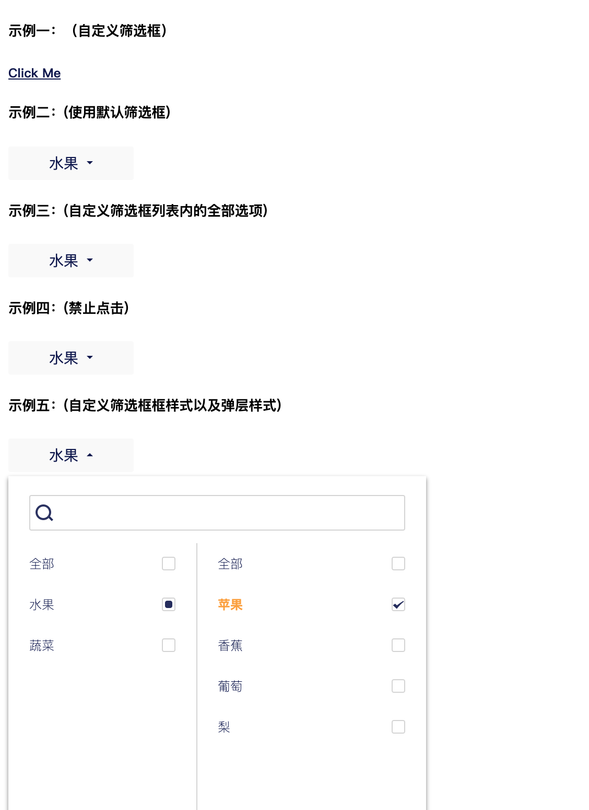

## react-mul-select

* Created By ancf - (博客地址)[https://kafeihaoka.github.io/myBlog.html#/welcome]

* react-mul-select 为一款基于react实现的二级多选下拉框组件。



DEMO示例地址：https://kafeihaoka.github.io/react-mul-select/

## 安装依赖
npm i react-mul-select -S

## API 介绍

| Property | Description | Type | Default |
| --- | --- | --- | --- |
| containerClassName | 组件外层容器className | string | - |
| popClass | 弹框容器className | string | - |
| isOpen | 是否展开 - showInput为false时生效；使用场景：自定义外部input框;需在onOk控制props isOpen | bool | - |
| showInput | 是否展示input | bool | true |
| selectAllMainValue | value all | object | - |
| selectAllSubValue | subValue all | object | - |
| value | value list | array | - |
| options | original options | array | - |
| onOk | 关闭下拉框的事件 | func | - |
| disabled | 禁止点击 | bool | true |
| onChange | change事件 | bool | true |

## 用法示例

```

import ReactMulSelect from "react-mul-select";

const MulSelectDemo = () => {
	const [selectValue, setSelectValue] = useState(['0-0']);
	const [isOpen, setIsOpen] = useState(false);
	const options = [
	  {
		"children": [
		  {
			"value": "0",
			"label": "苹果"
		  },
		  {
			"value": "1",
			"label": "香蕉"
		  }
		],
		"value": "0",
		"label": "水果"
	  },
	  {
		"children": [
		  {
			"value": "0",
			"label": "玉米"
		  },
		  {
			"value": "1",
			"label": "紫薯"
		  },
		  {
			"value": "2",
			"label": "地瓜"
		  }
		],
		"value": "1",
		"label": "蔬菜"
	  }
	]
	const selectAllMainValue = {value:'-1',label:'全部品牌'};
	const selectAllSubValue = {value:'-1',label:'全部账号'};
  
	const handleOk1 = (v) => {
	  console.log(v)
	  
	}
  
	const handleOk2 = (v) => {
	  console.log(v)
	}
  
	const openEffectPlan = () => {
	  setIsOpen(!isOpen)
	}
  
	return (
		<div>
			<ReactMulSelect
				showInput={false}
				isOpen={isOpen}
				selectAllMainValue={selectAllMainValue}
				selectAllSubValue={selectAllSubValue}
				value={selectValue}
				options={options}
				onOk={handleOk1}>
				<h1 onClick={openEffectPlan}>Component Test</h1>
			</ReactMulSelect>

			<ReactMulSelect
				showInput
				selectAllMainValue={selectAllMainValue}
				selectAllSubValue={selectAllSubValue}
				value={selectValue}
				options={options}
				onOk={handleOk2} />
		</div>
	);
}

ReactDOM.render(<MulSelectDemo />, mountNode);

```

## 相关资料

- react  component  react-mul-select

